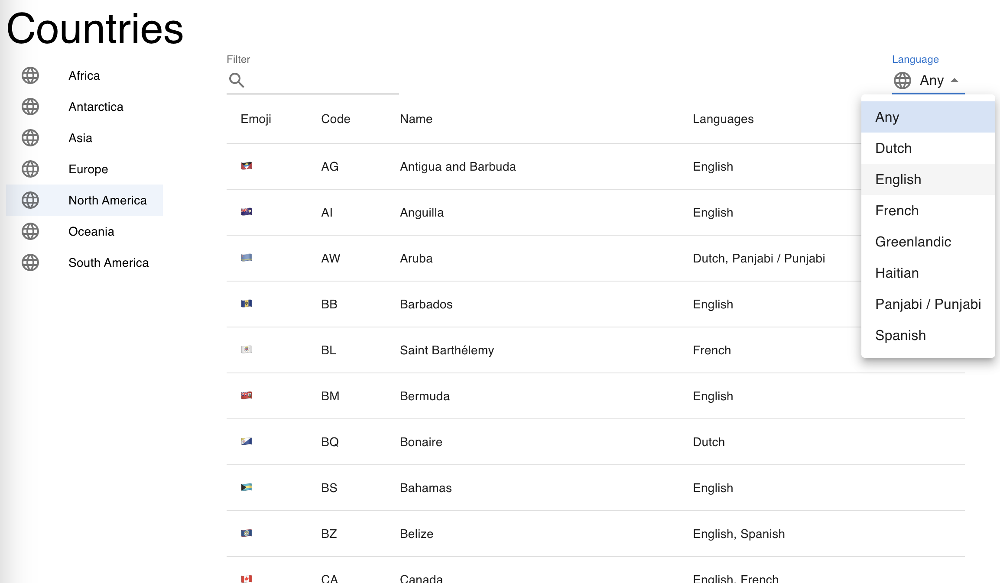

### Prompt

We're interested in learning more about the world. We'd like you to provide us
a list of known continents and all the countries within those continents.

This should be implemented first as a list of available continents that when
clicked on will display a list of all the countries within those continents
(along with other basic metadata). You should provide the ability to filter
the list of countries as well as a language dropdown that filters the list
of countries by the languages they speak.

You should use the following public GraphQL API endpoint that will provide you
with all the data you need:

https://studio.apollographql.com/public/countries/variant/current/home

### Running
Run `npm run dev` to start the dev server that will build your files with hot module
replacement.

### Submitting
Branch off `main` locally, make your edits, then send us a zip file. Do **not**
create a fork off of this repo and we'd greatly prefer you do not publicly
post your challenge submission to avoid others copying it!

`git archive -o challenge.zip HEAD`

### Evaluation criteria
 - Please limit yourself to approximately **3 hours**! We do understand that
   not everyone is familiar with all of these technologies, so we'd be
   interested in understanding how much time you spend reading documentation
   and how much time you spend writing code.
 - All interactive aspects of the table should function intuitively.
 - We will check for good TypeScript usage and errors!
 - We use MUI and it's been included for you, but if you want to hand-craft your CSS
   or use another UI framework, go for it!
 - Keep it organized: component composition and file structure should reflect what you
   might see in a larger project.
 - Go as deep or shallow as you need, pull in any third-pary libraries you're
   familiar with if they'll help, and generally challenge assumptions. Make
   sure to provide explanations either in your submission or inline in the code
   for why you made certain choices or used certain libraries!

### Resources
[GraphQL](https://graphql.org/learn/)
[MUI](https://mui.com/material-ui/getting-started/)
