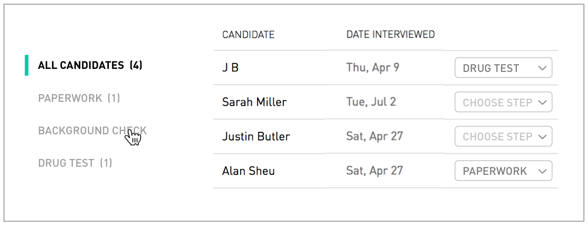
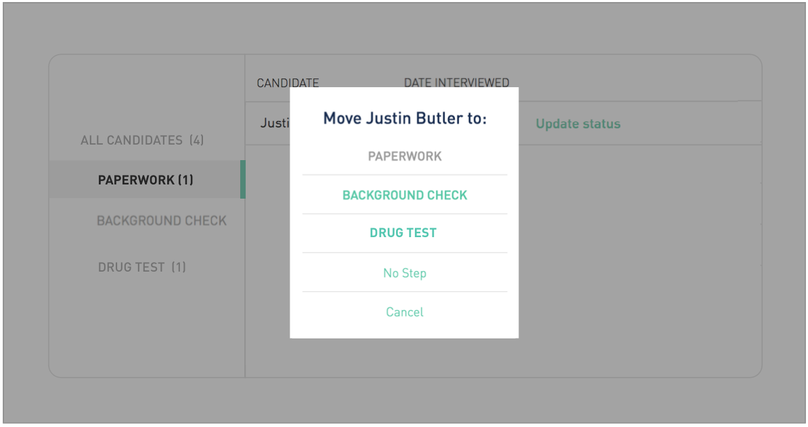

# react-challenge

Logged-in hiring managers see a tabbed table called "My Pipeline" that lists job applicants in their various stages.
Implement this table as shown in the following screenshots using the following API as a data source:

<< url-to-api >>

Your app should `PATCH` applicant stage updates, though please note that the demo API will not actually 
persist the changes

