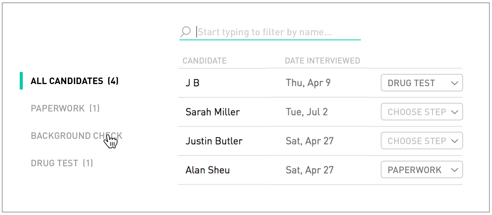

# react-challenge

Please limit yourself to approx. 3 hours

### Submitting
Branch off `trunk` locally, make your edits, then send us a zip

`git archive -o challenge.zip HEAD`

### Prompt
Logged-in hiring managers see a tabbed table called "My Pipeline" that lists job applicants
in their various interview steps. Implement this table as shown in the following screenshots
using the following REST API as a data source:

https://my-json-server.typicode.com/workstep/react-challenge-data/candidates

Your app should `PATCH` applicant step updates when they occur, though please note that
the demo API will not actually persist the changes:

https://my-json-server.typicode.com/workstep/react-challenge-data/candidates/[id]

### Running
Run `npm run serve` to start the dev server that will build your files with hot module
replacement. If you need to change the port, you can find it in `webpack.config.js`.

### Evaluation criteria
 - All interactive aspects of the table should function intuitively.
 - No UI frameworks, please! We'd like to see your styling capabilities
 - Redux might be overkill for this table in a vacuum, but it sure is tidier and more 
   extensible than a bunch of inline logic. Consider leveraging it for the steps and name filter.
 - Keep it organized: component composition and file structure should reflect what you
   might see in a larger project.
